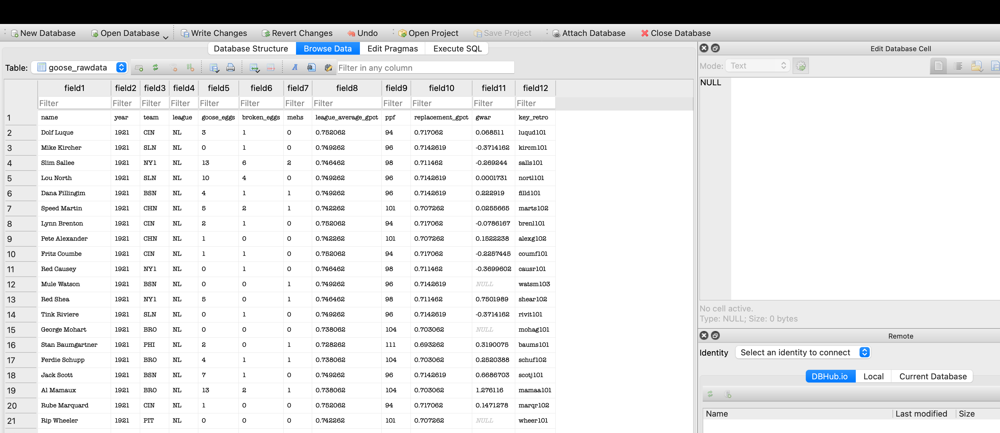
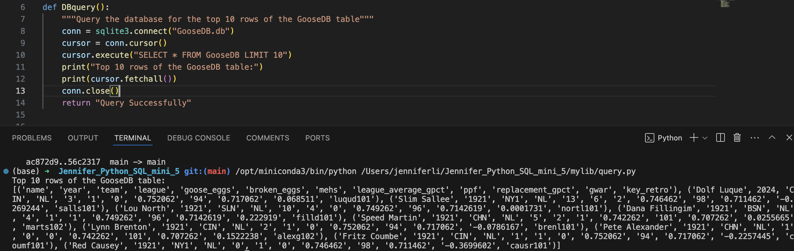
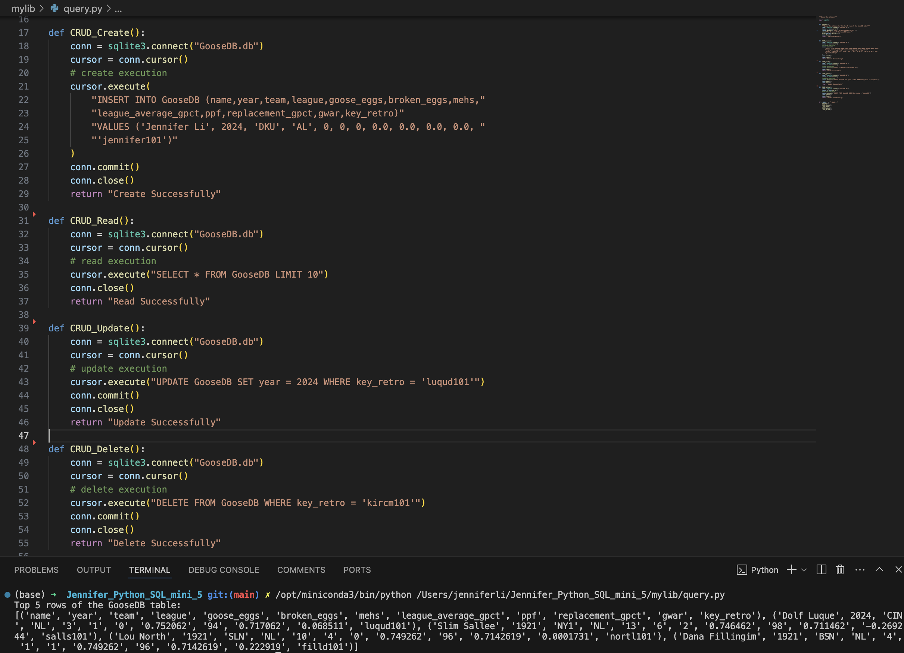
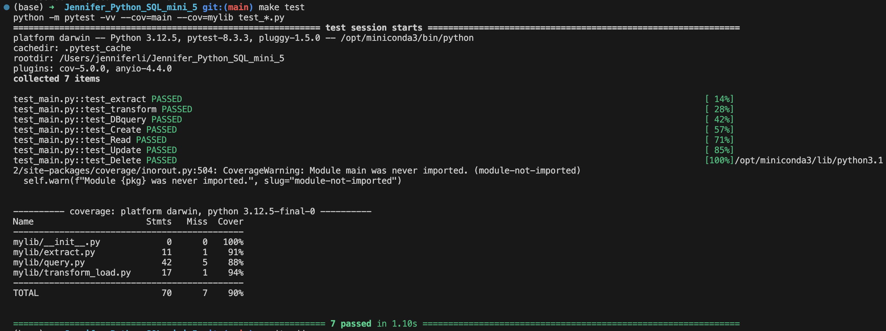

# Mini Project 5: Python Script interacting with SQL Database

## Project Purpose
This mini 5 project focuses on integrating Python scripting with SQL databases, allowing for efficient data manipulation and retrieval. The main objectives are to establish database connections, perform CRUD (Create, Read, Update, Delete) operations, and execute various SQL queries.

## Project Data Source
The data used in this project comes FiveThirtyEight's public dataset: https://raw.githubusercontent.com/fivethirtyeight/data/refs/heads/master/goose/goose_rawdata.csv 

## Project Features
1. Data Extraction: Fetch data from a URL and save it locally
2. Data Transformation and Loading: Process the extracted data and load it into a SQLite database
3. Database Querying: Perform various SQL queries on the loaded data
4. CRUD Operations: Demonstrate Create, Read, Update, and Delete operations on the database
5. Automated Testing: Includes test cases for all major functionalities

### Data Extraction & Transformation
Use function 'extract()' to fetch data from a URL and save it as the CSV data. Then use the function 'load()' to transforms the CSV data and loads it into a SQLite database named GooseDB.db

### SQL Queries

### Database Operations

### Testing

## References
https://github.com/nogibjj/sqlite-lab

